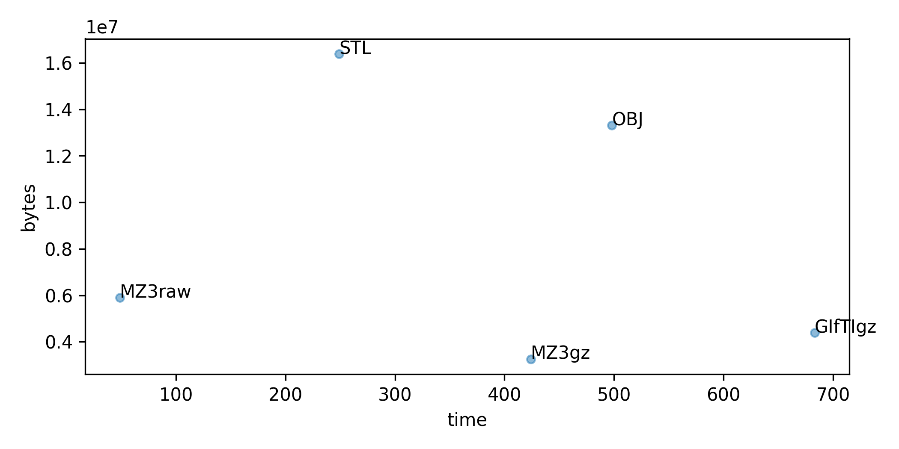

## About

This is a simple evaluation of different mesh formats used in neuroimaging. Feel free to suggest changes to optimize performance. JavaScript demonstrates a lot of speed variability. To mitigate this, each format is converted 10 times, with the time for the first run omitted.

A few notes on the formats:
 1. [GIfTI](https://www.nitrc.org/projects/gifti/) uses `GZipBase64Binary` with the optimal `RowMajorOrder`.
 2. [mz3](https://github.com/neurolabusc/surf-ice/tree/master/mz3) tested as both GZip compressed and raw formats.
 3. [OBJ](https://brainder.org/tag/wavefront-obj/) is an ASCII format, so a choice must be made regarding file size and precision.
 4. [STL](http://paulbourke.net/dataformats/stl/) format does not re-use vertices. The resulting mesh will appear faceted and use more GPU resources unless one applies a computationally expensive operation to weld vertices.
 5. [jmsh](https://en.wikipedia.org/wiki/JMesh) is a JSON-based general purpose geometry/mesh-data container based on the [JMesh](https://github.com/NeuroJSON/jmesh/blob/master/JMesh_specification.md) and [JData](https://github.com/NeuroJSON/jdata/blob/master/JData_specification.md) specifications; it is human-readable and widely parsable
 6. [bmsh](https://en.wikipedia.org/wiki/JMesh) is a binary-JSON ([BJData - Draft 2](https://github.com/NeuroJSON/bjdata/blob/Draft_2/Binary_JData_Specification.md)) based mesh-data container based on the JMesh specification; both `.bmsh` and `.jmsh` support data-level compression
 7. [json](http://json.org) is a minimized plain JSON file using [JMesh](https://github.com/NeuroJSON/jmesh/blob/master/JMesh_specification.md) annotations without compression



## Compiling

This is a simple node.js function that you can replicate on your own computer:

```
$ npm install gifti-reader-js atob numjs pako buffer
$ git clone https://github.com/neurolabusc/MeshFormatsJS.git
$ cd MeshFormatsJS
$ node ./meshtest.js

gifti.gii	Size	4384750	Time	2111
gz.mz3	Size	3259141	Time	541
raw.mz3	Size	5898280	Time	31
obj.obj	Size	13307997	Time	5318
stl.stl	Size	16384084	Time	1075
zlib.jmsh	Size	4405604	Time	660
zlib.bmsh	Size	3259049	Time	479
raw.min.json	Size	12325881	Time	1239
raw.bmsh	Size	5898902	Time	38

```
